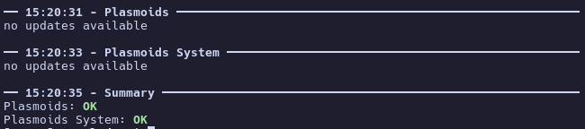

# plasmoid-updater

Updates KDE Plasma 6 components from KDE Store using a combination of Apdatifier's and KDE Discover's logic.

> [!IMPORTANT]
> The core logic (a combination of **Apdatifier** and **KDE Discover**) was ported to Rust with AI assistance (Claude Code and GH Copilot). The code was audited and tested by me. Feel free to contribute with an issue or PR.

## Requirements

- bsdtar, kpackagetool6
- [Rust](https://rust-lang.org/tools/install/)

## Installation

**Using Cargo (Recommended)**
```
cargo install plasmoid-updater
```

**From source using Cargo:**

```
git clone https://github.com/uwuclxdy/plasmoid-updater
cd plasmoid-updater
cargo install --path plasmoid-updater/
```

**Binary release**

Precompiled binary available on [GitHub Releases](https://github.com/uwuclxdy/plasmoid-updater/releases/latest).

## Usage

```
$ plasmoid-updater --help
update kde plasma components from the kde store

Usage: plasmoid-updater [OPTIONS] [COMMAND]

Commands:
  check           check for available updates
  list-installed  list all installed components
  update          update components

Options:
      --system                 operate on system-wide components (needs sudo)
      --edit-config            open configuration file in editor
      --skip-plasma-detection  skip KDE Plasma detection
  -h, --help                   Print help
  -V, --version                Print version
```

```
$ plasmoid-updater update --help
update components

Usage: plasmoid-updater update [OPTIONS] [COMPONENT]

Arguments:
  [COMPONENT]  component name or directory to update

Options:
      --restart-plasma         automatically restart plasmashell
      --no-restart-plasma      do not restart plasmashell
  -y, --yes                    automatically confirm all updates
      --system                 operate on system-wide components (needs sudo)
      --skip-plasma-detection  skip KDE Plasma detection
  -h, --help                   Print help

```

## Topgrade integreation (Preview)

[Topgrade](https://github.com/topgrade-rs/topgrade/) is a CLI tool that updates everything with a single command.

As this is meant to be a part of Topgrade at some point, I thought it's worth showing how to add it as a custom step until it's not officially supported.

Run `topgrade --edit-config` and add the following under `[commands]`:

```toml
[commands]
"Plasmoids" = "plasmoid-updater update -y"
"Plasmoids System" = "plasmoid-updater update -y --system"
```



## Supported (Updatable) Components

| Component Type             | KDE Store Category |
| -------------------------- | ------------------ |
| Plasma Widgets (Plasmoids) | 705                |
| Wallpaper Plugins          | 715                |
| KWin Effects               | 719                |
| KWin Scripts               | 720                |
| Global Themes              | 722                |
| Plasma Styles              | 709                |
| Aurorae Window Decorations | 114                |
| Color Schemes              | 112                |
| Splash Screens             | 708                |
| SDDM Themes                | 101                |

---

## License

Licensed under [GPL-3.0-or-later](https://www.gnu.org/licenses/gpl-3.0.html).

## Acknowledgments & Credits

This project was made possible by studying and learning from:

### [Apdatifier](https://github.com/exequtic/apdatifier)

**Author:** [exequtic](https://github.com/exequtic)
**License:** [MIT License](https://github.com/exequtic/apdatifier/blob/main/LICENSE.md)

Apdatifier is a KDE Plasma widget that monitors for updates to Arch Linux packages, Flatpak applications, and Plasma widgets. The widget update logic, version comparison algorithms, ID resolution fallback chain, and the `widgets-id` mapping table in this project are derived from Apdatifier's implementation.

Concepts taken from Apdatifier:
- 3-tier ID resolution strategy (name matching → KNewStuff registry → static lookup table)
- Version normalization and comparison algorithm
- Download link selection logic for multi-file packages
- Metadata patching approach for installation

### [KDE Discover](https://invent.kde.org/plasma/discover)

**License:** GPL-2.0-only, GPL-3.0-only, LicenseRef-KDE-Accepted-GPL

KDE Discover is the official software center for KDE Plasma. The understanding of KNewStuff registry file formats, kpackagetool6 usage patterns, and OCS API interaction in this project is based on studying Discover's source code.

Concepts taken from KDE Discover:
- KNewStuff registry structure (`.knsregistry` files)
- Installation flow via kpackagetool6
- OCS API v1.6 response format and status codes

### Open Collaboration Services (OCS) API

The [OCS specification](https://www.freedesktop.org/wiki/Specifications/open-collaboration-services/) defines the REST API used by the KDE Store (store.kde.org / api.kde-look.org).

---

*This project is not affiliated with or endorsed by KDE e.V.*
